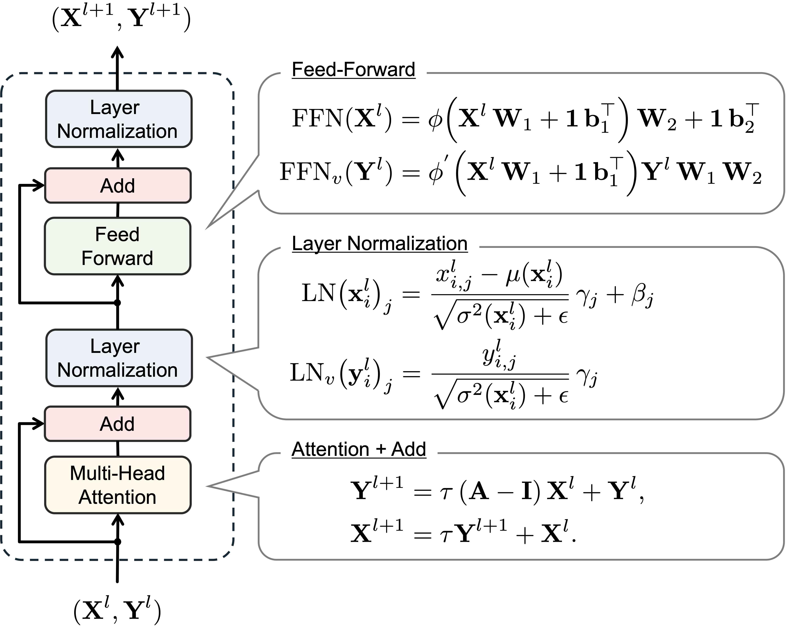

# Wavy Transformer

[](https://opensource.org/licenses/MIT)

This repository contains the **official implementation** of **Wavy Transformer**, accepted at **NeurIPS**. See our paper on [arXiv](https://arxiv.org/abs/2508.12787). 

---

## Introduction

Transformers have achieved remarkable success in both natural language processing (NLP) and computer vision (CV). However, deep transformer models can suffer from **over-smoothing**, where token representations converge to similar values as they pass through successive blocks.  

**Wavy Transformer** mitigates this issue by introducing:

* a novel attention layer based on **second-order wavy dynamics**,  
* a feed-forward network and normalization layer that preserve the physical state–velocity relationship implied by the chain rule.

Across diverse NLP and CV benchmarks, Wavy Transformer consistently improves performance **with minimal extra parameters and no additional hyper-parameter tuning**.

<p align="center">
  
</p>

---

## Contents

This repository comprises two main components:

* **NLP Tasks**: Everything related to pretraining the BERT-base model, fine-tuning on downstream benchmarks (GLUE and SQ2AD), and analyzing oversmoothing behavior.
* **CV Tasks**: Scripts and examples for ImageNet object classification using Vision Transformers, including training, evaluation, and analyzing oversmoothing behavior.

## Citation

We will update this section with the **formal citation** once the paper and **NeurIPS** metadata are publicly available.
In the meantime, if you find *Wavy Transformer* useful, please cite the arXiv preprint (once live) or link to this repository.

- Paper: [arXiv](https://arxiv.org/abs/2508.12787).
- Code: this repository

<!-- TODO: Replace the BibTeX below with the NeurIPS proceedings entry after the conference metadata is public. -->

### BibTeX (temporary, arXiv)
```bibtex
@inproceedings{wavy_transformer,
  title     = {Wavy Transformer},
  author    = {Satoshi Noguchi, Yoshinobu Kawahara},
  booktitle = {Proceedings of the Neural Information Processing Systems (NeurIPS) Conference},
  year      = {2025},
  note      = {To be updated with volume, pages, and publisher after public release}
}
}
